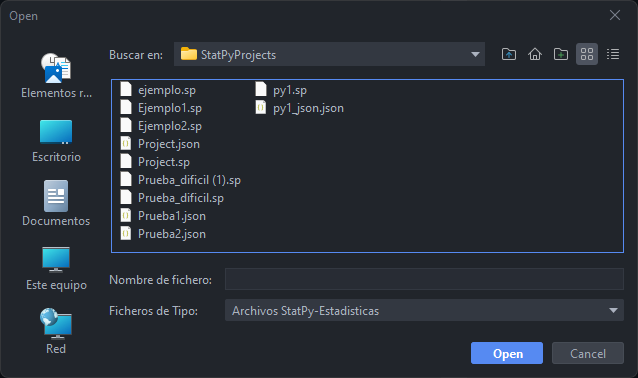
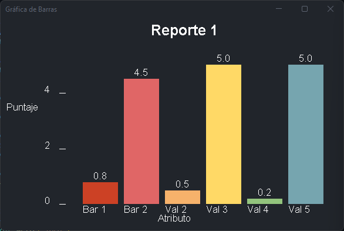
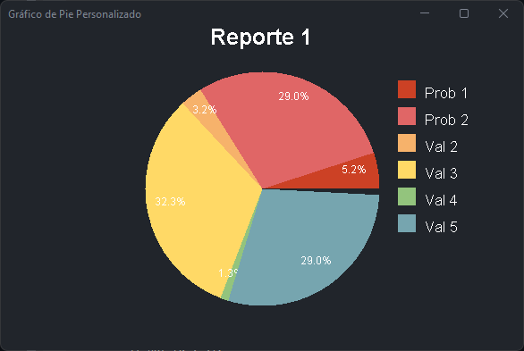

# **PROYECTO 1 - COMPILADORES 1**
### **StatPy Convertor**

Brandon Andy Jefferson Tejaxún Pichiyá - 202112030

## 📌 **Manual de Usuario**

1. **Abrir Archivo**

    Se debe dar clic sobre la opción correspondiente en la barra de herramientas y deberá seleccionar el archivo que se requiera abrir. Al haberlo abierto se mostrará el contenido del archivo en el editor.

    

        
        
    

 

2. **Nuevo Archivo / Guardar Como**

    Se debe dar clic sobre la opción correspondiente en la barra de herramientas y deberá seleccionar la extensión con la que se requiera guardar el nuevo archivo.
    

        
        
    

3. **Analizador Json**

    Al seleccionar un archivo con la extension **.json**, se debe dar clic en el icono de play para poder ejecutar el programa. En la consola un mensaje exitoso.

    

        
    

3. **Analizador StatPy**

    Al seleccionar un archivo con la extension **.sp**, se debe dar clic en el icono de play para poder ejecutar el programa. En la consola se mostrará la traducción del código StatPy a Python.

    

        
    

4. **Gráficas**

    Al tener declarado funciones estadísticas y cada uno de sus requerimientos como lo son la funcion de **Globales**, se podrán visualizar las gráficas al darle clic a la opción correpondiente.

    

        
        
    

5. **Reportes**

    Al ejecutar un archivo se genera un reporte de tokens y errores léxicos.

    

        
        
    

 

## 📌 **Manual Técnico**

### 1. **StatPY**

1. **Análisis Léxico**

    |Descripción|Patrón|Expresión Regular|Ejemplo|Nombre de Token|
    |:-|:-|:-|:-|:-|
    |Reservada main|Palabra main|main|main|RW_main|
    |Reservada void|Palabra void|void|void|RW_void|
    |Reservada int|Palabra int|int|int|RW_int|
    |Reservada double|Palabra double|double|double|RW_double|
    |Reservada char|Palabra char|char|char|RW_char|
    |Reservada bool|Palabra bool|bool|bool|RW_bool|
    |Reservada string|Palabra string|string|string|RW_string|
    |Reservada if|Palabra if|if|if|RW_if|
    |Reservada else|Palabra else|else|else|RW_else|
    |Reservada switch|Palabra switch|switch|switch|RW_switch|
    |Reservada case|Palabra case|case|case|RW_case|
    |Reservada default|Palabra default|default|default|RW_default|
    |Reservada break|Palabra break|break|break|RW_break|
    |Reservada for|Palabra for|for|for|RW_for|
    |Reservada while|Palabra while|while|while|RW_while|
    |Reservada do|Palabra do|do|do|RW_do|
    |Reservada true|Palabra true|true|true|RW_true|
    |Reservada false|Palabra false|false|false|RW_false|
    |Reservada Console.Write|Palabra Console.Write|Console.Write|Console.Write|RW_print|
    |Reservada Titulo|Palabra Tituloe|Titulo|Titulo|RW_title|
    |Reservada Ejex|Palabra Ejex|Ejex|Ejex|RW_xAxis|
    |Reservada Valores|Palabra Valores|Valores|Valores|RW_values|
    |Reservada TituloX|Palabra TituloX|TituloX|TituloX|RW_titleX|
    |Reservada TituloY|Palabra TituloY|TituloY|TituloY|RW_titleY|
    |Reservada DefinirGlobales|Palabra DefinirGlobales|DefinirGlobales|DefinirGlobales|RW_defG|
    |Reservada GraficaBarras|Palabra GraficaBarras|GraficaBarras|GraficaBarras|RW_barG|
    |Reservada GraficaPie|Palabra GraficaPie|GraficaPie|GraficaPie|RW_pieG|
    |Reservada NewValor|Palabra NewValor|NewValor|NewValor|RW_newVal|
    |Caracteres Alfabéticos|Caracter: a, b, c, ..., y,z, A, B, ..., Y, Z|\"({([^\n\"\\]\|\\.)}*)\"|a, c, D, E|TK_char|
    |Numeros enteros|Caracter: 0, 1, 2, ...|[0-9]+|0, 1, 2|Tk_int|
    |Numeros decimales|Caracter: 0.5, 1.5, 2.5, ...|[0-9]+\.[0-9]+|0.5, 1.5, 2.5|Tk_double|
    |Identificadores|Secuencia de caracteres alfanumericos|\"({([^\n\"\\]\|\\.)}*)\"|Cadena, num_pares|TK_string|
    |Incremento|Caracter ++|++|++|TK_inc|
    |Signo más|Caracter +|+|+|TK_plus|
    |Signo menos|Caracter -|-|-|TK_minus|
    |Signo multiplicacion|Caracter *|*|*|TK_mult|
    |Signo división|Caracter /|/|/|TK_div|
    |Comparación|Caracter ==|==|==|TK_equequ|
    |Diferente de|Caracter !=|!=|!=|TK_notequ|
    |Menor o igual|Caracter <=|<=|<=|TK_lessequ|
    |Mayor o igual|Caracter >=|>=|>=|TK_moreequ|
    |Igual|Caracter =|=|=|TK_equal|
    |Menor|Caracter <|<|<|TK_less|
    |Mayor|Caracter >|>|>|TK_more|
    |AND|Caracter &&|&&|&&|TK_and|
    |OR|Caracter \|\||\|\||\|\||TK_or|
    |NOT|Caracter !|!|!|TK_not|
    |Dollar|Caracter $|$|$|TK_dollar|
    |Parentesis abierto|Caracter (|(|(|TK_lpar|
    |Parentesis cerrado|Caracter )|)|)|TK_rpar|
    |Llave abierto|Caracter {|{|{|TK_lbrc|
    |Llave cerrado|Caracter }|}|}|TK_rbrc|
    |Corchete abierto|Caracter [|[|[|TK_lbrk|
    |Corchete cerrado|Caracter ]|]|]|TK_rbrk|
    |Coma|Caracter ,|,|,|TK_comma|
    |Dos puntos|Caracter :|:|:|TK_colon|
    |Puntos y coma|Caracter ;|;|;|TK_semicolon|
    |Comentarios Simple|Caracter //|"//"([^\r\n]*)?|// comentario simple||
    |Comentarios Multilineas|Caracter /**/|[/][*][^*]*[*]+([^/*][^*]*[*]+)*[/]|// comentario simple||

 
 
 

2. **Análisis Sintáctico**

    [Gramática StatPy](GrammarStatPy.md)

### 2. **Json**

1. **Análisis Léxico**

    |Descripción|Patrón|Expresión Regular|Ejemplo|Nombre de Token|
    |:-|:-|:-|:-|:-|
    |Caracteres Alfabéticos|Caracter: a, b, c, ..., y,z, A, B, ..., Y, Z|\"({([^\n\"\\]\|\\.)}*)\"|a, c, D, E|
    |Numeros decimales|Caracter: 0.5, 1.5, 2.5, ...|[0-9]+\.[0-9]+|0.5, 1.5, 2.5|Tk_double|
    |Llave abierto|Caracter {|{|{|TK_lbrc|
    |Llave cerrado|Caracter }|}|}|TK_rbrc|
    |Coma|Caracter ,|,|,|TK_comma|
    |Dos puntos|Caracter :|:|:|TK_colon|
    |Comentarios Simple|Caracter //|"//"([^\r\n]*)?|// comentario simple||
    |Comentarios Multilineas|Caracter /**/|[/][*][^*]*[*]+([^/*][^*]*[*]+)*[/]|// comentario simple||

2. **Análisis Sintáctico**

    [Gramática StatPy](GrammarJson.md)